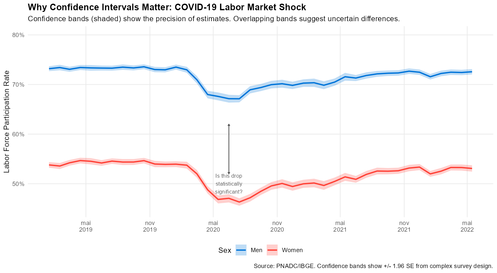
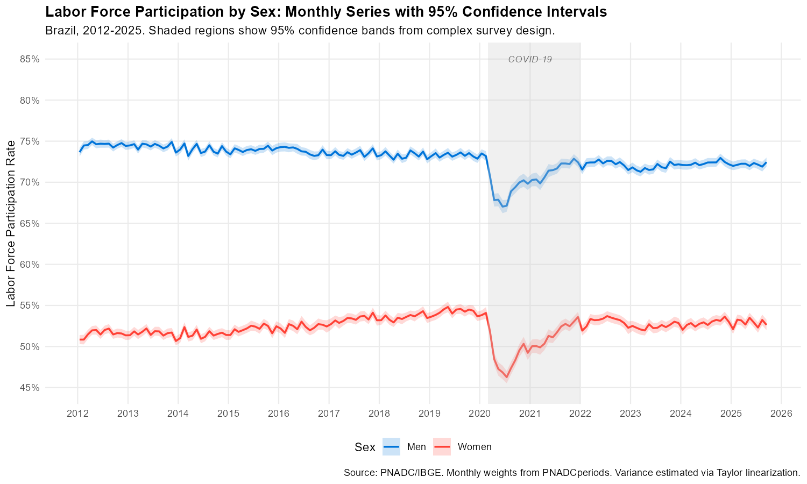
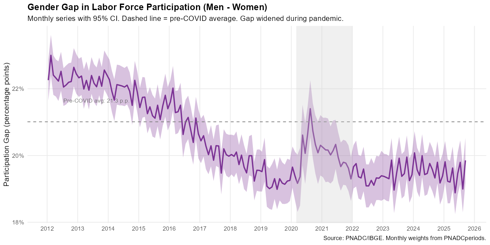

<!--
MAINTAINER NOTE:
The code chunks in this vignette must match the code in:
  mensalizacao_pnad/code/generate_complex_survey_figures.R

Look for comments like "# --- VIGNETTE CODE: chunk-name ---" in that script.
To regenerate figures, run that script. Changes to code here
must be mirrored in the generation script (and vice versa).
-->

```{r setup, include = FALSE}
knitr::opts_chunk$set(
  eval = FALSE,
  echo = TRUE,
  collapse = TRUE,
  comment = "#>",
  message = FALSE,
  warning = FALSE,
  fig.width = 10,
  fig.height = 6,
  purl = FALSE
)
```

## Introduction

When you compute a statistic from survey data---say, the unemployment rate is 7.2%---that number alone doesn't tell you much. Is 7.2% meaningfully different from last month's 7.0%? Without **standard errors** and **confidence intervals**, you can't answer this question.

This matters especially when tracking changes over time. Monthly data from `PNADCperiods` reveals dynamics hidden in quarterly averages, but those sharp month-to-month movements could be real economic changes or just sampling variability. Standard errors let you distinguish signal from noise.

The challenge is that PNADC uses a **complex sample design**---stratification (`Estrato`), clustering (`UPA`), and unequal probabilities---which means standard formulas underestimate variance. This vignette shows two strategies for proper variance estimation:

1. **Linearization**: Using design variables directly---simple and fast
2. **Replication weights**: Adjusting IBGE's 200 bootstrap weights---more intensive but exact

We demonstrate both using the **gender gap in labor force participation**, which widened dramatically during COVID-19.

---

## Why Standard Errors Matter

Before diving into methodology, consider the figure below. It shows labor force participation for men and women during COVID-19. The **shaded bands** are 95% confidence intervals from proper complex survey analysis.

<details>
<summary>Show plotting code</summary>

```{r plot-why-se-matter, fig.width=10, fig.height=5.5}
# Subset to COVID period for focused visualization
p3_data <- results_by_sex[period >= "2019-01-01" & period <= "2022-06-01"]

p3 <- ggplot(p3_data, aes(x = period, y = participation, color = sex)) +

  # Just the lines (no CI)
  geom_line(linewidth = 0.9) +

  # Add confidence bands with low alpha
  geom_ribbon(aes(ymin = ci_l, ymax = ci_u, fill = sex),
              alpha = 0.25, color = NA) +

  # Scales and labels
  scale_y_continuous(
    labels = percent_format(accuracy = 1),
    limits = c(0.45, 0.80)
  ) +
  scale_x_date(date_breaks = "6 months", date_labels = "%b\n%Y") +
  scale_color_manual(values = c("Men" = "#0074D9", "Women" = "#FF4136")) +
  scale_fill_manual(values = c("Men" = "#0074D9", "Women" = "#FF4136")) +

  # Add annotations for interpretation
  annotate("segment",
           x = as.Date("2020-06-15"), xend = as.Date("2020-06-15"),
           y = 0.52, yend = 0.62,
           arrow = arrow(ends = "both", length = unit(0.1, "cm")),
           color = "gray30") +
  annotate("text",
           x = as.Date("2020-06-15"), y = 0.50,
           label = "Is this drop\nstatistically\nsignificant?",
           size = 2.8, color = "gray30") +

  labs(
    title = "Why Confidence Intervals Matter: COVID-19 Labor Market Shock",
    subtitle = "Confidence bands (shaded) show the precision of estimates. Overlapping bands suggest uncertain differences.",
    x = NULL,
    y = "Labor Force Participation Rate",
    color = "Sex",
    fill = "Sex",
    caption = "Source: PNADC/IBGE. Confidence bands show +/- 1.96 SE from complex survey design."
  ) +

  theme_minimal(base_size = 11) +
  theme(
    plot.title = element_text(face = "bold"),
    legend.position = "bottom",
    panel.grid.minor = element_blank()
  )
p3
```

</details>

{width=100%}

Without confidence intervals, we might over-interpret month-to-month fluctuations as real economic changes. With them, we can assess which movements are statistically meaningful.

---

## Prerequisites

```{r packages}
# Core packages
library(PNADCperiods)
library(data.table)
library(fst)

# Survey analysis
library(survey)

# Visualization
library(ggplot2)
library(scales)
```

---

## Loading and Preparing Data

```{r load-data}
# Load stacked PNADC quarterly data (all years available)
# Requires: identification vars, calibration vars, Estrato, plus analysis vars
files <- list.files("D:/Dropbox/Bancos_Dados/PNADC/Trimestral/Dados/",
                    pattern = "^pnadc_\\d{4}-\\dq\\.fst$", full.names = TRUE)

cols_needed <- c(
  # Mensalization keys
  "Ano", "Trimestre", "UPA", "V1008", "V1014",
  # Birthday variables (for identification)
  "V2008", "V20081", "V20082", "V2009",
  # Calibration variables
  "V1028", "UF", "posest", "posest_sxi",
  # Survey design variables
  "Estrato",
  # Analysis variables
  "VD4001", "VD4002", "V2007"
)

pnadc <- rbindlist(lapply(files, function(f) {
  fst::read_fst(f, as.data.table = TRUE, columns = cols_needed)
}), fill = TRUE)

# Step 1: Build crosswalk (identify reference periods)
crosswalk <- pnadc_identify_periods(pnadc, verbose = TRUE)

# Step 2: Apply crosswalk and calibrate weights
pnadc <- pnadc_apply_periods(pnadc, crosswalk,
                              weight_var = "V1028",
                              anchor = "quarter",
                              calibrate = TRUE,
                              calibration_unit = "month",
                              verbose = TRUE)

# Filter to determined observations with monthly weights
pnadc_monthly <- pnadc[!is.na(weight_monthly)]

# Handle singleton strata globally
options(survey.lonely.psu = "adjust")
```

---

## Strategy 1: Linearization with Strata and PSU

This approach uses **Taylor series linearization** to estimate variances. PNADC uses a two-stage stratified cluster sample: within each stratum (`Estrato`), Primary Sampling Units (`UPA`) are selected with probability proportional to size, then households within selected UPAs are interviewed.

### Setting Up a Survey Design

```{r design-linearization}
# Create survey design object for a specific month (e.g., January 2020)
pnadc_jan2020 <- pnadc_monthly[ref_month_yyyymm == 202001 & V2009 >= 14]

design_jan2020 <- svydesign(
  ids = ~UPA,                    # PSU/cluster identifier
  strata = ~Estrato,             # Stratification variable
  weights = ~weight_monthly,     # Monthly-adjusted weight
  data = pnadc_jan2020,
  nest = TRUE                    # UPAs nested within strata
)

# Labor force participation rate
svymean(~I(VD4001 == 1), design_jan2020, na.rm = TRUE)
confint(svymean(~I(VD4001 == 1), design_jan2020, na.rm = TRUE))
```

### Monthly Time Series with Confidence Intervals

To create a full monthly series, loop over months with a function that handles edge cases:

```{r compute-gender-series}
# Prepare analysis data
pnadc_monthly[, V2009 := as.integer(V2009)]
pnadc_analysis <- pnadc_monthly[V2009 >= 14]
pnadc_analysis[, VD4001 := as.integer(VD4001)]
pnadc_analysis[, in_labor_force := fifelse(VD4001 == 1, 1L, 0L)]
pnadc_analysis[, V2007 := as.integer(V2007)]
pnadc_analysis[, sex := fifelse(V2007 == 1, "Men", "Women")]

# Function to compute participation by sex for one month
compute_participation_by_sex <- function(month_yyyymm, data) {

  month_data <- data[ref_month_yyyymm == month_yyyymm]

  if (nrow(month_data) < 100) return(NULL)

  tryCatch({
    design <- svydesign(
      ids = ~UPA,
      strata = ~Estrato,
      weights = ~weight_monthly,
      data = month_data,
      nest = TRUE
    )

    result <- svyby(
      ~in_labor_force,
      by = ~sex,
      design = design,
      FUN = svymean,
      na.rm = TRUE,
      vartype = c("se", "ci")
    )

    setDT(result)
    result[, ref_month_yyyymm := month_yyyymm]
    result
  }, error = function(e) {
    cat("Error processing month", month_yyyymm, ":", e$message, "\n")
    NULL
  })
}

# Compute for all months
months <- sort(unique(pnadc_analysis$ref_month_yyyymm))
results_by_sex <- rbindlist(
  lapply(months, compute_participation_by_sex, data = pnadc_analysis)
)

# Rename estimate column for clarity
setnames(results_by_sex, "in_labor_force", "participation")

# Add date column for plotting
results_by_sex[, period := as.Date(paste0(
  ref_month_yyyymm %/% 100, "-",
  ref_month_yyyymm %% 100, "-15"
))]
```

The `tryCatch` wrapper handles months where the survey design might fail (e.g., sparse data in early pandemic months). The `svyby()` function returns columns `participation`, `se`, `ci_l`, and `ci_u`.

---

## Strategy 2: Replication Weights

IBGE provides 200 **bootstrap replication weights** (`V1028001` to `V1028200`) with each quarterly release. This approach is more computationally intensive (201 computations per statistic) but handles complex statistics like quantiles, Gini coefficients, and regression coefficients without special variance formulas.

The key insight: apply the **same calibration ratio** to each replication weight:

$$
\text{V1028}_k^{\text{monthly}} = \text{V1028}_k \times \frac{\text{weight\_monthly}}{\text{V1028}}
$$

```{r create-rep-weights}
# Calculate the adjustment ratio
pnadc_monthly[, weight_ratio := weight_monthly / V1028]

# Get names of replication weight columns
rep_weight_cols <- paste0("V1028", sprintf("%03d", 1:200))

# Create adjusted replication weight columns
for (col in rep_weight_cols) {
  new_col <- paste0(col, "_monthly")
  pnadc_monthly[, (new_col) := get(col) * weight_ratio]
}
```

```{r design-replication}
# Create replicate weights design (e.g., for January 2020)
pnadc_jan2020_rep <- pnadc_monthly[ref_month_yyyymm == 202001 & V2009 >= 14]
rep_weight_cols_monthly <- paste0("V1028", sprintf("%03d", 1:200), "_monthly")

design_rep <- svrepdesign(
  data = pnadc_jan2020_rep,
  weights = ~weight_monthly,
  repweights = rep_weight_cols_monthly,
  type = "bootstrap",
  combined.weights = TRUE
)

# Use the same svymean/svyby functions as with linearization
svymean(~I(VD4001 == 1), design_rep, na.rm = TRUE)
```

### Comparing Strategies

| Aspect | Linearization | Replication |
|--------|--------------|-------------|
| **Setup** | Simpler (strata + PSU) | More complex (200 weight columns) |
| **Speed** | Fast | Slower (200x calculations) |
| **Complex statistics** | May need special formulas | Handles automatically |
| **Best for** | Routine analysis | Quantiles, Gini, publications |

**Recommendation**: Use linearization for exploratory analysis and most routine work. Use replication when computing complex statistics or preparing results for publication.

---

## Practical Example: Gender Gap in Labor Force Participation

Brazil has one of the largest gender gaps in labor force participation among major economies---about 20 percentage points. COVID-19 provides a natural experiment: school closures and increased caregiving demands fell disproportionately on women. Monthly data lets us track whether the gap widened, and confidence intervals tell us if the change was statistically significant.

### Computing the Gender Gap

The gap is a derived statistic: the difference between two survey estimates. We derive it from the by-sex results already computed above:

```{r compute-gap}
# Reshape to wide format to compute gap
results_wide <- dcast(results_by_sex, ref_month_yyyymm + period ~ sex,
                      value.var = c("participation", "se"))

# Compute gap and its SE
# SE of difference: SE(gap) = sqrt(SE_men^2 + SE_women^2)
results_wide[, `:=`(
  gap = participation_Men - participation_Women,
  gap_se = sqrt(se_Men^2 + se_Women^2)
)]

results_wide[, `:=`(
  gap_ci_lower = gap - 1.96 * gap_se,
  gap_ci_upper = gap + 1.96 * gap_se
)]
```

### Visualizing the Results

<details>
<summary>Show plotting code</summary>

```{r plot-gender-gap, fig.width=10, fig.height=6}
# Reshape back to long for plotting
results_long <- results_by_sex[!is.na(participation)]

# Ensure proper CI columns exist
if (!"ci_l" %in% names(results_long)) {
  results_long[, ci_l := participation - 1.96 * se]
  results_long[, ci_u := participation + 1.96 * se]
}

p1 <- ggplot(results_long, aes(x = period, y = participation, color = sex, fill = sex)) +

  # Confidence bands
  geom_ribbon(aes(ymin = ci_l, ymax = ci_u), alpha = 0.2, color = NA) +

  # Point estimates
  geom_line(linewidth = 0.8) +

  # Highlight COVID period
  annotate("rect",
           xmin = as.Date("2020-03-01"), xmax = as.Date("2021-12-31"),
           ymin = -Inf, ymax = Inf,
           fill = "gray80", alpha = 0.3) +
  annotate("text",
           x = as.Date("2021-01-01"), y = 0.85,
           label = "COVID-19", fontface = "italic", size = 3, color = "gray40") +

  # Scales and labels
  scale_y_continuous(
    labels = percent_format(accuracy = 1),
    limits = c(0.45, 0.85),
    breaks = seq(0.45, 0.85, 0.05)
  ) +
  scale_x_date(date_breaks = "1 year", date_labels = "%Y") +
  scale_color_manual(values = c("Men" = "#0074D9", "Women" = "#FF4136")) +
  scale_fill_manual(values = c("Men" = "#0074D9", "Women" = "#FF4136")) +

  labs(
    title = "Labor Force Participation by Sex: Monthly Series with 95% Confidence Intervals",
    subtitle = "Brazil, 2012-2025. Shaded regions show 95% confidence bands from complex survey design.",
    x = NULL,
    y = "Labor Force Participation Rate",
    color = "Sex",
    fill = "Sex",
    caption = "Source: PNADC/IBGE. Monthly weights from PNADCperiods. Variance estimated via Taylor linearization."
  ) +

  theme_minimal(base_size = 11) +
  theme(
    plot.title = element_text(face = "bold"),
    legend.position = "bottom",
    panel.grid.minor = element_blank()
  )
p1
```

</details>

{width=100%}

The confidence bands for men and women never overlap, confirming that the gender gap is statistically significant in every month. Women's participation dropped more sharply during COVID-19 (from ~53% to below 47%) than men's (from ~73% to ~66%).

<details>
<summary>Show plotting code</summary>

```{r plot-gap, fig.width=10, fig.height=5}
# Pre-COVID average for reference line
pre_covid_avg <- results_wide[period < "2020-03-01", mean(gap, na.rm = TRUE)]

p2 <- ggplot(results_wide[!is.na(gap)], aes(x = period, y = gap)) +

  # Confidence band
  geom_ribbon(aes(ymin = gap_ci_lower, ymax = gap_ci_upper),
              fill = "#7b3294", alpha = 0.3) +

  # Point estimate
  geom_line(color = "#7b3294", linewidth = 0.9) +

  # Reference line at pre-COVID average
  geom_hline(
    yintercept = pre_covid_avg,
    linetype = "dashed", color = "gray50"
  ) +
  annotate("text", x = min(results_wide$period, na.rm = TRUE) + 180,
           y = pre_covid_avg + 0.008,
           label = paste0("Pre-COVID avg: ", sprintf("%.1f", pre_covid_avg * 100), " p.p."),
           size = 3, color = "gray40", hjust = 0) +

  # Highlight COVID period
  annotate("rect",
           xmin = as.Date("2020-03-01"), xmax = as.Date("2021-12-31"),
           ymin = -Inf, ymax = Inf,
           fill = "gray80", alpha = 0.3) +

  # Scales and labels
  scale_y_continuous(
    labels = percent_format(accuracy = 1),
    breaks = seq(0.15, 0.30, 0.025)
  ) +
  scale_x_date(date_breaks = "1 year", date_labels = "%Y") +

  labs(
    title = "Gender Gap in Labor Force Participation (Men - Women)",
    subtitle = "Monthly series with 95% CI. Dashed line = pre-COVID average. Gap widened during pandemic.",
    x = NULL,
    y = "Participation Gap (percentage points)",
    caption = "Source: PNADC/IBGE. Monthly weights from PNADCperiods."
  ) +

  theme_minimal(base_size = 11) +
  theme(
    plot.title = element_text(face = "bold"),
    panel.grid.minor = element_blank()
  )
p2
```

</details>

{width=100%}

The gap widened from ~20 to ~23 percentage points during COVID-19, and the confidence bands confirm this increase was statistically significant. The gap returned to pre-pandemic levels by 2022.

---

## Practical Tips

### Singleton Strata

Some months may have strata with only one PSU. The `options(survey.lonely.psu = "adjust")` setting (shown in the data preparation section above) provides a conservative adjustment. Other options include `"remove"` and `"average"`.

### Subpopulation Analysis

When analyzing subgroups, **always subset the design object**, not the raw data:

```{r subpop}
# CORRECT: Subset the design
design_women <- subset(design_jan2020, V2007 == 2)
svymean(~I(VD4001 == 1), design_women, na.rm = TRUE)

# INCORRECT: Don't do this - loses design information
# bad_design <- svydesign(..., data = pnadc[V2007 == 2])
```

Subsetting the data before creating the design object loses information about the full sample structure, leading to incorrect variance estimates.

---

## Summary

This vignette demonstrated two approaches for computing standard errors with monthly PNADC weights:

1. **Linearization**: Use `Estrato` as strata, `UPA` as PSU, and `weight_monthly` as weight in `svydesign()`. Fast, simple, works for most statistics.
2. **Replication**: Multiply each bootstrap weight by `weight_monthly / V1028`. More intensive but exact for complex statistics.

The gender gap example demonstrated that confidence intervals transform a claim like "the gap looks bigger" into "the gap increased by 2-3 percentage points, and we're 95% confident it's real."

---

## References

- HECKSHER, Marcos. "Valor Impreciso por Mes Exato: Microdados e Indicadores Mensais Baseados na Pnad Continua". IPEA - Nota Tecnica Disoc, n. 62. Brasilia, DF: IPEA, 2020. <https://portalantigo.ipea.gov.br/portal/index.php?option=com_content&view=article&id=35453>
- HECKSHER, M. "Cinco meses de perdas de empregos e simulacao de um incentivo a contratacoes". IPEA - Nota Tecnica Disoc, n. 87. Brasilia, DF: IPEA, 2020.
- HECKSHER, Marcos. "Mercado de trabalho: A queda da segunda quinzena de marco, aprofundada em abril". IPEA - Carta de Conjuntura, v. 47, p. 1-6, 2020.
- Thomas Lumley (2010). *Complex Surveys: A Guide to Analysis Using R*. Wiley.
- IBGE. *Notas Metodologicas da PNAD Continua*.
- Barbosa, Rogerio J; Hecksher, Marcos. (2026). PNADCperiods: Identify Reference Periods in Brazil's PNADC Survey Data. R package version v0.1.0. <https://github.com/antrologos/PNADCperiods>

---

## Further Reading

- [Get Started](getting-started.html) - Basic mensalization workflow
- [Applied Examples](applied-examples.html) - Monthly labor market analysis with figures
